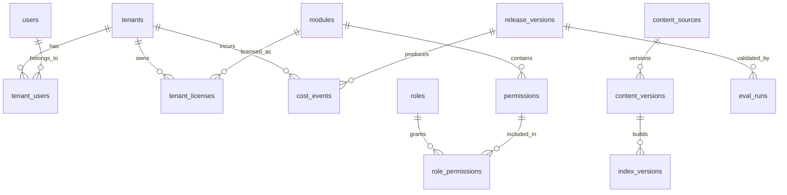

# Platform Metadata Schema V1

Status: draft  
Version: platform-metadata-schema-v1

This document defines the relational metadata model for AegisRAG. Large documents, embeddings, generated chunks, and vector indexes are not stored as relational source-of-truth data. They are stored in object storage and search/vector systems, with metadata tracked here.

## Design Principles

1. Tenant, license, role, and permission data must be queryable deterministically.
2. Release versions must be auditable and reversible.
3. Eval runs must be linked to candidate releases.
4. Cost events must be attributable by tenant, route, and model.
5. Sensitive user content should not be stored in relational metadata.

## Core Tables



## Tables

### tenants

| Column | Type | Notes |
|---|---|---|
| tenant_id | string | primary key |
| name | string | display name |
| region | string | data residency/routing region |
| status | string | active, suspended, disabled |
| created_at | timestamp | audit |
| updated_at | timestamp | audit |

### users

| Column | Type | Notes |
|---|---|---|
| user_id | string | primary key |
| external_subject | string | SSO/OIDC subject |
| status | string | active, disabled |
| created_at | timestamp | audit |
| updated_at | timestamp | audit |

### tenant_users

| Column | Type | Notes |
|---|---|---|
| tenant_id | string | foreign key |
| user_id | string | foreign key |
| role_id | string | foreign key |
| status | string | active, disabled |

### modules

| Column | Type | Notes |
|---|---|---|
| module_id | string | primary key |
| name | string | human-readable module name |
| status | string | active, deprecated |

### tenant_licenses

| Column | Type | Notes |
|---|---|---|
| tenant_id | string | foreign key |
| module_id | string | foreign key |
| license_status | string | active, expired, disabled |
| effective_from | timestamp | license start |
| effective_to | timestamp | nullable |

### roles

| Column | Type | Notes |
|---|---|---|
| role_id | string | primary key |
| name | string | role name |
| scope | string | global or tenant |

### permissions

| Column | Type | Notes |
|---|---|---|
| permission_id | string | primary key |
| module_id | string | owning module |
| action | string | view, edit, submit, admin |

### role_permissions

| Column | Type | Notes |
|---|---|---|
| role_id | string | foreign key |
| permission_id | string | foreign key |

### content_sources

| Column | Type | Notes |
|---|---|---|
| source_id | string | primary key |
| source_type | string | doc, kb, transcript, synthetic |
| owner | string | owning team |
| trust_level | string | approved, draft, blocked |
| source_uri | string | object storage or external URI |

### content_versions

| Column | Type | Notes |
|---|---|---|
| content_version_id | string | primary key |
| source_id | string | foreign key |
| checksum | string | content hash |
| metadata_uri | string | object storage URI |
| created_at | timestamp | audit |

### index_versions

| Column | Type | Notes |
|---|---|---|
| index_version_id | string | primary key |
| content_version_id | string | source content version |
| index_type | string | keyword, vector, hybrid, graph |
| embedding_model_version | string | nullable |
| chunker_version | string | nullable |
| index_uri | string | index name or artifact URI |
| status | string | building, ready, failed, retired |

### release_versions

| Column | Type | Notes |
|---|---|---|
| release_id | string | primary key |
| app_version | string | service/application version |
| content_version_id | string | content version |
| index_version_id | string | index version |
| prompt_version | string | prompt config |
| policy_version | string | policy config |
| guardrail_version | string | guardrail config |
| router_config_version | string | route config |
| status | string | candidate, staging, canary, prod, rolled_back |

### eval_runs

| Column | Type | Notes |
|---|---|---|
| eval_run_id | string | primary key |
| release_id | string | candidate release |
| eval_dataset_version | string | eval data |
| passed | boolean | release gate result |
| score_summary_uri | string | object storage URI |
| created_at | timestamp | audit |

### cost_events

| Column | Type | Notes |
|---|---|---|
| cost_event_id | string | primary key |
| tenant_id | string | tenant attribution |
| release_id | string | release attribution |
| route | string | cache, graph, rag-small, rag-strong |
| provider | string | model/search/cache provider |
| model_name | string | nullable |
| input_tokens | integer | nullable |
| output_tokens | integer | nullable |
| cost_usd | decimal | estimated or actual |
| occurred_at | timestamp | event time |

## Migration Rule

This schema will be implemented through Alembic migrations under:

```text
services/platform-metadata/migrations/
```

