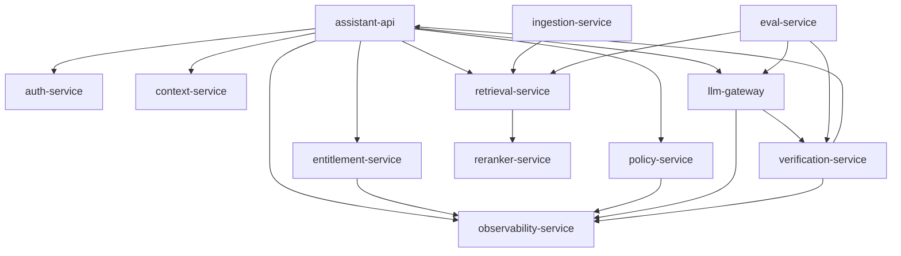

# Service Inventory V1

This inventory defines the initial service boundaries for the AegisRAG Platform.

## Services

| Service | Responsibility | State | Security Critical |
|---|---|---|---|
| auth-service | authenticate caller identity and produce principal | stateless/provider-backed | yes |
| assistant-api | public API orchestration and streaming | stateless | yes |
| entitlement-service | tenant, license, module, role, permission envelope | cached + source-backed | yes |
| policy-service | deterministic can-ask/can-retrieve/can-answer/can-cache decisions | policy store | yes |
| context-service | session state, memory, UI context, prompt context assembly | mixed | yes |
| retrieval-service | scoped hybrid retrieval and metadata filtering | stateless/index-backed | yes |
| reranker-service | ONNX/Triton/SageMaker reranking and small classification | model state | yes |
| llm-gateway | model/provider routing, token budgets, retries, fallback | config-backed | yes |
| verification-service | grounding, citation, permission, PII, policy checks | stateless | yes |
| ingestion-service | parse, chunk, enrich, embed, index content | batch state | yes |
| eval-service | offline/online evals and release gates | eval datasets | yes |
| observability-service | metrics, traces, audit fanout, cost ledger | telemetry | yes |

## Service Communication

## Service Design Rules

1. Services expose versioned APIs.
2. Security-critical services fail closed.
3. Every request carries a request ID and trace context.
4. Every AI response records prompt, policy, model, index, guardrail, eval, and cost metadata.
5. No service calls a foundation model directly except the LLM Gateway.
6. No service retrieves unscoped content.
